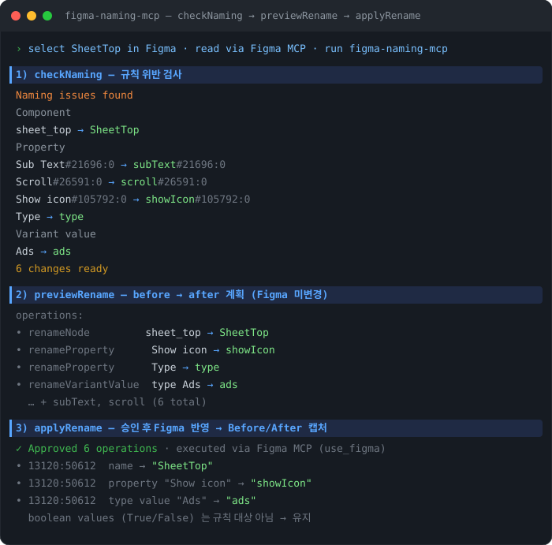

# Figma Naming MCP

Figma에서 **컴포넌트 / 프레임을 선택하면 네이밍 규칙에 맞게 검사하고 변경**해 주는 MCP 서버입니다.
Claude Code에서 `checkNaming → previewRename → applyRename` 3단계로 안전하게 이름을 정리합니다.

## 실행 화면



## 네이밍 규칙 (최종)

| 대상 | 규칙 | 예시 |
| --- | --- | --- |
| 컴포넌트 / 컴포넌트 세트 / 프레임명 | **PascalCase** (복합어 분리) | `bottomsheet` → `BottomSheet`, `sheet_top` → `SheetTop` |
| 속성명(Property) | **camelCase** | `Show icon` → `showIcon`, `Sub Text` → `subText` |
| Variant 문자열 값 | **소문자 시작** | `Selected` → `selected`, `Ads` → `ads` |
| Boolean 값 (True/False) | **변경 안 함** | Figma 내장 타입이라 편집 불가·규칙 대상 아님 |

- 복합어 분리는 사전(`DEFAULT_DICTIONARY`: bottom, sheet, full, top, ads, box, button …)으로 처리하며, 규칙 인자로 확장할 수 있습니다.

## 소개

실무에서 반복되는 Figma 네이밍 정리 작업을 자동화하기 위해 직접 MCP를 제작했다.
결정적(deterministic)인 규칙 엔진이라 같은 입력이면 항상 같은 결과를 내고, 검사 → 미리보기 → 승인 후 적용의 3단계로 안전하게 이름을 바꾼다.

## 동작 구조

MCP 서버는 다른 MCP 서버를 직접 호출할 수 없기 때문에, **Claude가 오케스트레이터** 역할을 한다.
이 서버는 Figma를 직접 건드리지 않고 오직 "이름 규칙"만 판단한다.

```
Claude ─(공식 Figma MCP)→ 선택된 노드 데이터 읽기
      └→ figma-naming-mcp: checkNaming / previewRename   (규칙 검사·제안)
      └(사용자 승인)→ figma-naming-mcp: applyRename        (변경 계획 확정)
      └(공식 Figma MCP)→ 실제 이름 반영 + Before/After 캡처
```

## 사전 준비물

- **Node.js 18+** (`node --version`)
- **Claude Code** (CLI 또는 데스크톱 앱)
- **공식 Figma MCP** 연결 — 이 서버는 Figma를 직접 건드리지 않고 "이름 규칙"만 판단하므로, 실제 Figma 읽기/쓰기/캡처를 담당하는 공식 Figma MCP가 함께 연결돼 있어야 합니다. ([Figma Dev Mode MCP](https://help.figma.com/hc/en-us/articles/32132100833559))

## 설치 방법

```bash
# 1. 클론
git clone https://github.com/<USERNAME>/figma-naming-mcp.git
cd figma-naming-mcp

# 2. 의존성 설치
npm install

# 3. 테스트 (규칙 엔진 검증 — 11개 통과 확인)
npm test

# 4. Claude Code에 로컬 MCP 등록 (현재 폴더 기준 절대경로)
claude mcp add figma-naming -- node "$(pwd)/index.js"
```

> `<USERNAME>` 은 이 저장소를 올린 GitHub 계정으로 바꾸세요.

등록 후 `/mcp` 로 `figma-naming` 과 공식 Figma MCP가 모두 연결됐는지 확인합니다.

## Claude Code에서 사용법

1. Figma 데스크톱 앱에서 정리할 **컴포넌트 / 프레임을 선택**합니다.
2. Claude Code에 이렇게 요청합니다:

   > "선택한 컴포넌트 네이밍을 규칙에 맞게 검사하고 정리해줘"

3. Claude가 공식 Figma MCP로 선택을 읽어 `checkNaming` → `previewRename` 결과(`before → after`)를 보여줍니다.
4. 확인 후 승인하면 `applyRename` → 공식 Figma MCP로 **실제 이름을 변경**하고 Before/After를 캡처합니다.
   (이름 변경이라 Figma에서 `Cmd+Z`로 되돌릴 수 있습니다.)

## 제공 도구

| 도구 | 설명 |
| --- | --- |
| `checkNaming` | 선택된 Frame / Component / Property / Variant 값 네이밍을 규칙 대비 검사하고 위반 항목 리포트 |
| `previewRename` | 변경 예정 목록(`before → after`)과 실행용 `operations` 출력 (Figma 미변경) |
| `applyRename` | 승인된 변경안을 Figma 실행용 매니페스트로 확정 |
| `getConvention` | 현재 적용 중인 기본 컨벤션 반환 |

`operations`는 3종류입니다 — `renameNode`(이름), `renameProperty`(속성명), `renameVariantValue`(variant 값). 클라이언트(Claude)가 이를 공식 Figma MCP의 `use_figma`로 실행합니다:

- `renameNode` → `node.name = to`
- `renameProperty` → `componentSet.editComponentProperty(from, { name: to })`
- `renameVariantValue` → variant 자식 컴포넌트의 `name`을 `prop=value`에서 값만 교체

### 입력 형식

`nodes` 는 공식 Figma MCP로 읽은 선택 노드 배열이다.

```json
{
  "nodes": [
    {
      "id": "1:23",
      "name": "sheet_top",
      "type": "COMPONENT_SET",
      "properties": [
        { "name": "Sub Text#21:0", "type": "TEXT" },
        { "name": "Show icon#10:0", "type": "BOOLEAN" },
        { "name": "Type", "type": "VARIANT", "values": ["basic", "Ads", "sentence"] }
      ]
    },
    { "id": "1:24", "name": "Frame 123", "type": "FRAME" }
  ],
  "names": { "1:24": "VehicleSummary" }
}
```

- `properties[].type`로 `BOOLEAN`을 알려주면 값(True/False)은 건드리지 않고, `VARIANT`의 `values`만 소문자 시작으로 정규화합니다.

- `Frame 123` 같은 **Figma 자동 이름**은 문자열만으로 의미 있는 이름을 만들 수 없다.
  이런 노드는 `needsInput` 으로 표시되고, Claude가 Figma 캡처로 내용을 파악해 `names` 로
  의미 있는 이름을 넣어 주면 규칙(PascalCase)으로 정규화한다.

## 적용 사례

실제 디자인 파일에서 Frame / Component / Property 네이밍을 검사하고 PascalCase / camelCase 규칙에 맞게 변경.

**결과 화면 예시**

```
Naming issues found

Component
sheet_top → SheetTop

Property
Sub Text#21:0 → subText#21:0
Show icon#10:0 → showIcon#10:0
Type → type

Variant value
Ads → ads

5 changes ready
```

## 컨벤션 커스터마이즈

모든 도구는 `convention` 인자로 규칙을 덮어쓸 수 있다.

```json
{ "convention": { "component": "PascalCase", "frame": "PascalCase", "property": "camelCase" } }
```

## 라이선스

ISC
